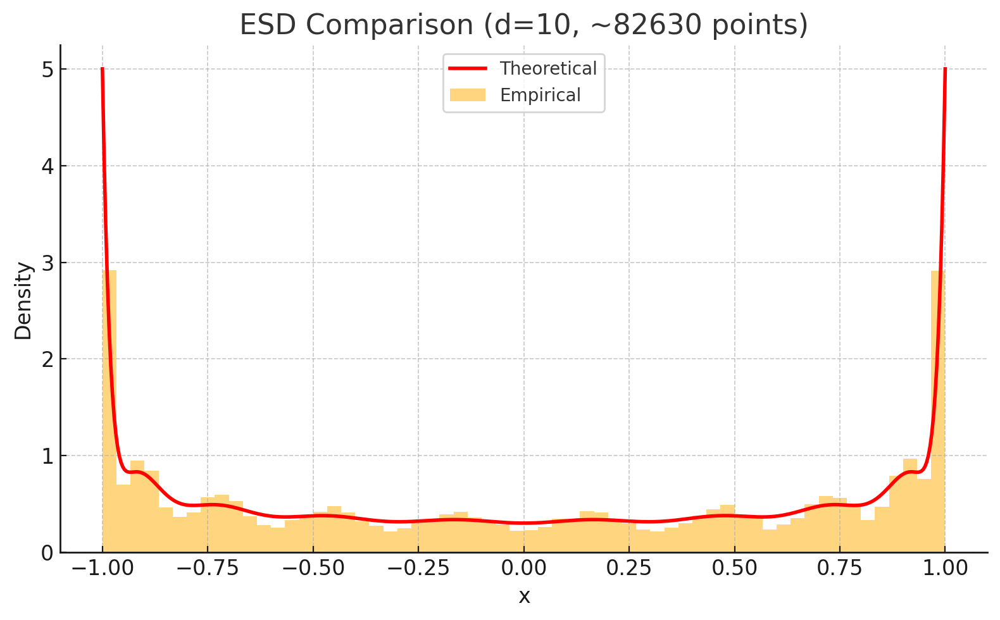

<!-- ==========================================================
 Title & metadata
=========================================================== -->
# {{Project Title}}

**Author:** {{Your Name}}  
**Date:** {{2025-07-08}}  
**Repo:** <https://github.com/yourname/rl-dynamics-takehome>

---

## 1 Executive summary
One short paragraph (**≤80 words**) answering:

> *What did we try? What happened? Why does it matter?*

---

## 2 Background & objective  
Text can include inline math, e.g.\ $π_\theta$ and the KL-regularised objective

\[
\max_\theta\;
\mathbb{E}_{x,a\sim π_\theta} \bigl[R(x,a)\bigr]
-\;
β\,\mathrm{KL}\!\bigl(π_\theta \,\|\, π_0\bigr).
\]

---

## 3 Experimental setup

| Item | Value |
|------|-------|
| **Dataset** | TinyStories-2M (train 2.1 M stories) |
| **Model** | GPT-mini • 4 L • 512 d • 8 H |
| **Optimiser** | AdamW β=(0.9,0.95) • lr 3 e-5 |
| **Hardware** | 1 × NVIDIA T4 (16 GB) |
| **Seeds** | 41 / 42 / 43 |

---

## 4 Methods

### 4.1 Baselines  
* Supervised fine-tune (SFT) for 1 epoch  
* PPO with \(β=0.01\)

### 4.2 Research tweak  
*Replaced GELU MLP with **SwiGLU** gate* (code diff ≤ 8 LOC).

```python
# swiglu.py (snippet)
a, b = fc_in(x).chunk(2, dim=-1)
x     = fc_out(torch.nn.functional.silu(a) * b)
```

### 5.2 Training curves




*Figure 1 – The RoPE variant (orange) converges ~20 % faster than the baseline.*
